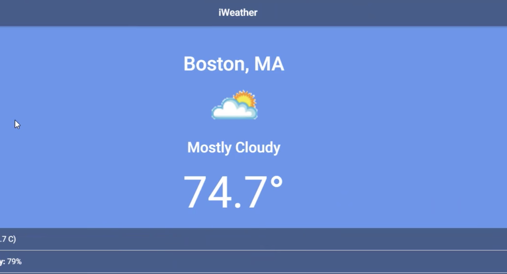

# iWeather

iWeather allow users to gather information regarding the weather in their current location or to search for the current climate in any city in the United States. Using the Ionic framework which was closely built off of Angular has had great benifits in allowing one to build iOS, Android and Windows applications. 

## Getting Started

### Prerequisites

Install the latest version of the Ionic framework globally on your machine.
Make sure to install the latest version of node (10.6.0) and npm (6.2.0) gloablly as well.

```
$ npm i -g ionic@latest
$ npm i -g node@latest
$ npm i -g npm@latest

```

### Installing

After cloning the repo, cd into the directory and install the required npm packages: 

```
npm i
```

## Try out the application



## Built With

* [Ionic](https://ionicframework.com/) - Native Framework
* [WUnderground](https://www.wunderground.com/) - Weather API

## Authors

* **Sam G. Zun** - [SZun](https://github.com/SZun)
